        
### Another Just Practical App

	The parametric calculator is designed for use in everyday situations where speed and ease of use is the most important thing. Half way through a calculation and need to find a new number, just swipe to the next calculator. Want to reuse a calculation you do often, just build it and save it with whatever name you like.

	

	

	Key Benefits

<ul class="c16 lst-kix_g5d5yzcoztqc-0 start">
	<li class="c8 c14 li-bullet-0">
		Switch between projects and return to just where you left off
	</li>
	<li class="c8 c14 li-bullet-0">
		Save variables and functions against a project or make available to all projects
	</li>
	<li class="c8 c14 li-bullet-0">
		Multiple Calculators available per project
	</li>
	<li class="c8 c14 li-bullet-0">
		Historical values easily accessible and can be pinned for quick selection
	</li>
	<li class="c8 c14 li-bullet-0">
		Set standard unit conversions to always show results in both units
	</li>
	<li class="c8 c14 li-bullet-0">
		Build your own functions and save as hotkeys
	</li>
	<li class="c8 c14 li-bullet-0">
		Include logic in your functions, 
	</li>
</ul>
<ul class="c16 lst-kix_g5d5yzcoztqc-1 start">
	<li class="c8 c23 li-bullet-0">
		e.g. vanLength = if wallHeight &gt;smallLadderHeight use longLadderHeight else smallLadderHeight
	</li>
</ul>
<ul class="c16 lst-kix_g5d5yzcoztqc-0">
	<li class="c8 c14 li-bullet-0">
		Fast data input with support for left and right handed use
	</li>
	<li class="c8 c14 li-bullet-0">
		Dark and Light themes
	</li>
	<li class="c8 c14 li-bullet-0">
		Human readable numbers configurable with , or . separators e.g. 1,955,354.13213
	</li>
</ul>

	

	

	

	

	

	

	

	

	

	

	

	

	

	

	

<h1 class="c35" id="h.v69yha942xlo">
	User Guide
</h1>
<h1 class="c41" id="h.l012wfrnapvr">
	
		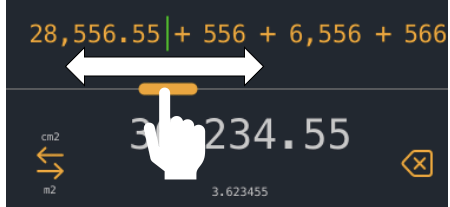
	
</h1>
<h2 class="c15" id="h.b2iimb71h591">
	1. The Top Bar 
</h2>

	
		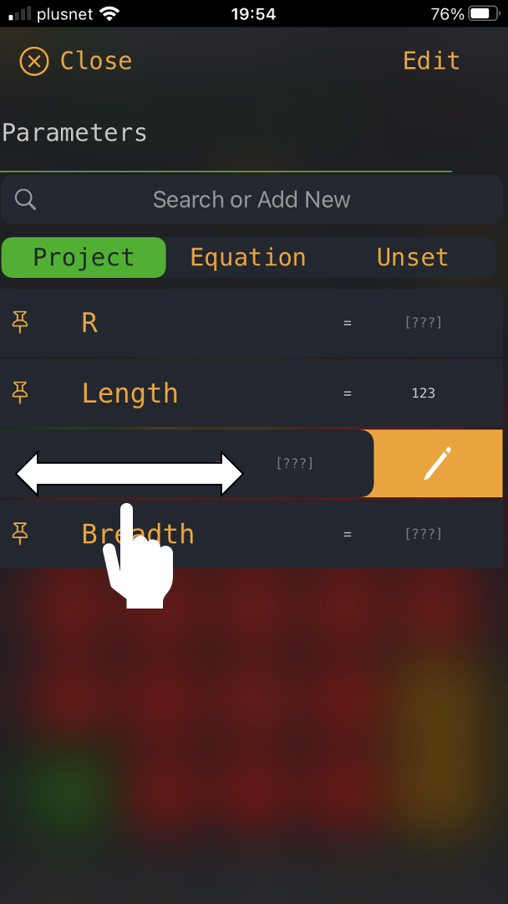
	

	

	Includes an indicator of which calculator you currently have selected in the highlight colour. If another calculator has a value in then its icon will appear filled in. &nbsp;You can tap on a calculator icon to jump straight to it or swipe across on the results panel

	

	
		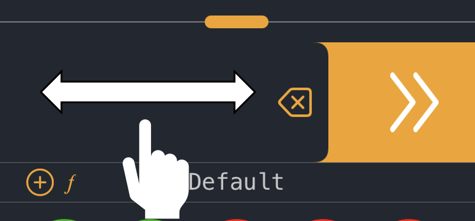
	

	

	To the far right it is possible to see which angle units the calculator is set to, in the example case Radians. You can change the selection for the current calculator on the advanced operators keypad (swipe right). The default type when starting a new project can be set in preferences by tapping in the gear icon.

	

	

<h2 class="c15" id="h.quuekco3labs">
	2. The Equation Bar
</h2>

	shows the active equation. You can drag the equation bar along if the calculation becomes too long or tap on any of the parts of the equation to edit them. To position the cursor tap between two items. You can use the scroll slider to move the cursor position around. When the cursor is not at the end of the equation the characters will be more spread out making it easier to select a position

	

	
		
	

	

	Any errors in the equation will be marked in red. This may be a variable that does not have a value set or could be a missing part of the calculation logic, for example adding two plus operations would not make sense and as such would be shown as below.

	

	1 + 
	[?]
	&nbsp;+ 2

	

	

	When selecting a part of an equation you can only directly replace it with a similar operator, so + and replace - but not %.

	

	

	

	In the case of a function, it will show you details of what variables are used in the equation. 

	

	
		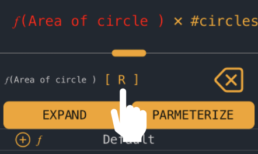
	

	Tapping on the variables will open up a list of all unset variables in the calculation to allow you to set them. Options will also be presented to

	

<ul class="c16 lst-kix_mldq066nlrst-0 start">
	<li class="c8 c14 li-bullet-0">
		Expand : Converts the equation into it constituent parts
	</li>
	<li class="c8 c14 li-bullet-0">
		Parameterize : Inserts the function with the option to change the variables that are used rather than needing to have a variable with the correct name present
	</li>
</ul>

	

	

	The delete key will delete the last number entered when inputting a new value, or the last whole value or operation entered

	

	

	

	

<h2 class="c15" id="h.40ra1t3lysas">
	3
	&nbsp;The Result Panel 
</h2>

	Shows the result of the current calculation. If the calculation is not valid the result of the last valid calculation is shown in a dull colour. If you have set up a unit conversion, then the converted number will be shown in a smaller font below.

	

<table class="c10">
	<tbody>
		<tr class="c1">
			<td class="c9" colspan="1" rowspan="1">
				

					You can copy a result by pressing and holding the result value. A popup will appear with options to copy / paste. Paste will only insert values if it is possible to do so. Note that pasting will extract all valid numbers, so will ignore for example currency symbols when copying from another app
				

			</td>
			<td class="c9" colspan="1" rowspan="1">
				

					
						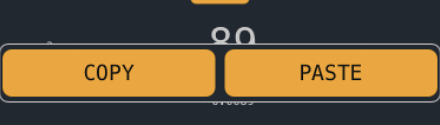
					
				

			</td>
		</tr>
	</tbody>
</table>

	

	If you need to show the number to someone else you can swipe up or down on the result and the number will be shown full screen. If you have a conversion set it will be shown in a duller colour underneath the main result value

	

	
		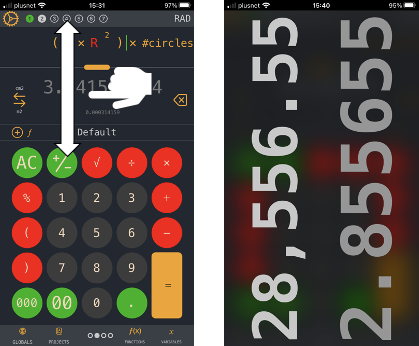
	

	

	

	A conversion symbol is shown to one side of the result. you can tap here to change your conversion units. If a conversion is selected the type of conversion is shown on the top and bottom of the symbol and the converted result is shown in a smaller font below the result

	

	
		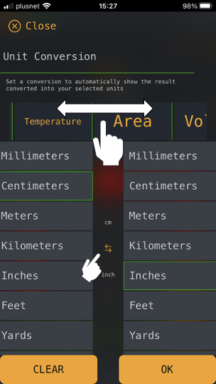
	

	

	From the conversion panel you can select different measurement types and select what you would like to convert. The column on the left is from, on the right is too. You can click on the conversion symbol in the center to quickly swap the from / to

	

	

	

<h2 class="c15" id="h.png9uwpcy3ho">
	4 The Project Bar
</h2>

	

	The project bar lets you quickly change projects by tapping on the project name. This loads the project center where you can pick a different project. 

	

<table class="c10">
	<tbody>
		<tr class="c1">
			<td class="c9" colspan="1" rowspan="1">
				

					
						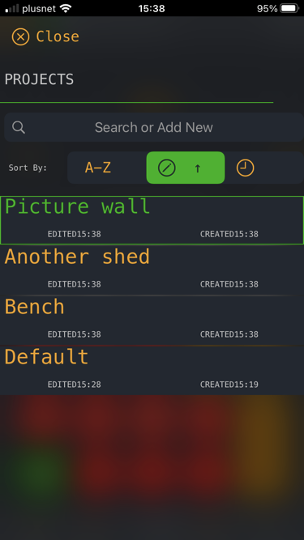
					
				

			</td>
			<td class="c9" colspan="1" rowspan="1">
				

					You can search for a project using the search bar. If you enter the name of a project that does not exist yet you will be shown an option to create it
				

				

					
				

				

					The sorting bar above the project list allows you toggle sorting 
				

				<ul class="c16 lst-kix_e9kcrof7zud6-0 start">
					<li class="c8 c14 li-bullet-0">
						Alphabetically
					</li>
					<li class="c8 c14 li-bullet-0">
						By time/date last used
					</li>
					<li class="c8 c14 li-bullet-0">
						By date created
					</li>
				</ul>
				

					
				

				

					Double tapping the search bar icon will reverse the sort order
				

				

					
				

			</td>
		</tr>
	</tbody>
</table>

	

	

	

<table class="c10">
	<tbody>
		<tr class="c1">
			<td class="c9" colspan="1" rowspan="1">
				

					The +f and +x symbols when shown allow you to save the current result, or the current equation. For equations you can choose to save against the project or globally. Global equations can be accessed from the Global tray and you can select the ones you want to copy to the current project
				

			</td>
			<td class="c9" colspan="1" rowspan="1">
				

					
						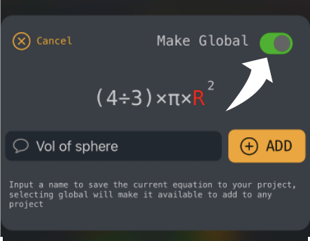
					
				

			</td>
		</tr>
	</tbody>
</table>

	

	

	

<h2 class="c7" id="h.hp051w36pfh3">
	
</h2>
<h2 class="c15" id="h.9br3nmsohw43">
	5 The Project Tray
</h2>

	The tray area gives access to saved functions and variables and gives another method to load up the project selector.

	

<h3 class="c22" id="h.g0wlqb3x5ej">
	Variables
</h3>

	
		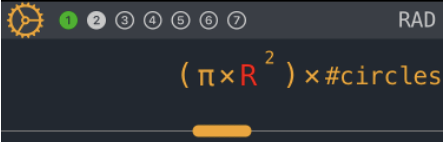
	

	

	Variables allow you to build up a calculation using placeholder values. This can be useful if you are planning a build but are not sure of final dimensions. In the above calculation we can see that two variables are used one called &ldquo;
	R
	&rdquo;and the other &ldquo;
	#circles
	&rdquo;. 
	R
	&nbsp;is highlighted in red as it does not have a value set.

	

	

	

<table class="c10">
	<tbody>
		<tr class="c1">
			<td class="c9" colspan="1" rowspan="1">
				

					To add a variable to a calculation tap the variables link in the project tray and you will see all of the available variables for the project. Using the filter toggle you can restrict this list to
				

				<ol class="c16 lst-kix_1ohwivbsqf8u-0 start" start="1">
					<li class="c8 c14 li-bullet-0">
						All variables in project
					</li>
					<li class="c8 c14 li-bullet-0">
						All variables used in current calculation
					</li>
					<li class="c8 c14 li-bullet-0">
						All empty variables in current calculation
					</li>
				</ol>
				

					
				

				

					To select a variable just tap it. A variable will only be added to the equation if the cursor is positioned somewhere that can receive it.
				

				

					
				

				

					To edit the value of a variable you can swipe left. Swiping right will delete it. On the edit page you can change its name, add a description and assign a value to it.
				

			</td>
			<td class="c9" colspan="1" rowspan="1">
				

					
						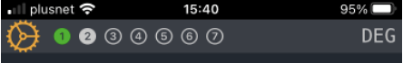
					
				

			</td>
		</tr>
	</tbody>
</table>

	

	

	

	

	

	

<h3 class="c22" id="h.q2uchvcdtfi">
	Functions
</h3>

	

	

	

	

	Functions can be used like variables, they can be inserted into a calculation by opening the functions view from the project tray and selecting the one you want. They can be inserted anywhere a variable can. Functions may contain variables and even other functions. 

	When you select a function the variables used in the function will be displayed. If any of these variables do not have a value assigned the function will be shown in red.

	

	

	

	

	Functions can be displayed in two ways, either just the name is shown, or the parameters that are fed into the function are exposed.

	

<h4 class="c38" id="h.ozyafqp9j700">
	&#x1d453;
	(myFunction)
</h4>

	

<table class="c10">
	<tbody>
		<tr class="c1">
			<td class="c9" colspan="1" rowspan="1">
				

					In this format the variables needed for the function to generate a value will not be shown in the equation view, but you can see what is needed by selecting the function. You will need to add variables with the same names in your project to calculate a value
				

				

					
				

				

					When selecting a function in this format you are given the option to expand or parameterise.
				

				

					
				

				

					Expanding will convert the function into the full equation, in the example this would become 
				

				

					
				

				

					
				

			</td>
			<td class="c9" colspan="1" rowspan="1">
				

					
						
					
				

			</td>
		</tr>
	</tbody>
</table>

	

	

	

<h4 class="c38" id="h.8001qvounydw">
	&#x1d453;
	(myFunction) [ variable1, variable2]
</h4>

	

<table class="c10">
	<tbody>
		<tr class="c1">
			<td class="c9" colspan="1" rowspan="1">
				

					In parameterized format, the values used for the function can be passed as parameters. This allows you to use the function without needing to create the variables needed for it.
				

				

					For example in the image you could replace the placeholder values for the radius and height with actual values
				

			</td>
			<td class="c9" colspan="1" rowspan="1">
				

					
						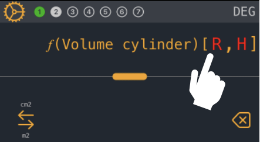
					
				

			</td>
		</tr>
	</tbody>
</table>

	

	

	

	&#x1d453;(volume cylinder) [ 30 , 45 * 2 ]

	

<h2 class="c15" id="h.q30r64qmzwz5">
	6 The Keypad
</h2>

	You can swipe left and right on the keypad to get to the advanced operators (right) or the historical values (left). The pages indicator in the project tray indicates the keypad you are currently on.

	

	Tapping on the indicator takes you back to the home page (Number Entry)

	
		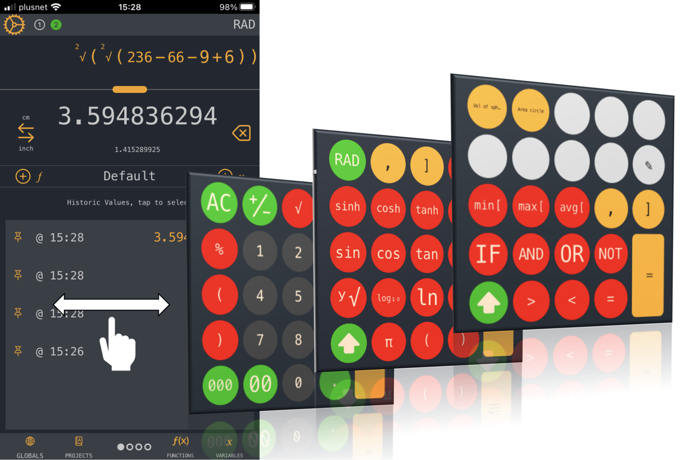
	

	

	The key where the equals button would normally be is dynamic. It shows the next operation that you need to perform. &nbsp;For example if you have an open set of brackets it will show you a close bracket. If you are entering parameters for a function that needs values entered, you will see both the , and the ] keys to either add more values or close the function.

	

	

	TOP TIP

	If you have a calculation that you need to put brackets around you can simply hit the close bracket and the whole equation will be wrapped. 

	

	Operator that can only be added at the start will automatically group the current calculation

	

	e.g. 

	

<table class="c10">
	<tbody>
		<tr class="c1">
			<td class="c12 c17" colspan="1" rowspan="1">
				

					Pressed
				

			</td>
			<td class="c5 c17" colspan="1" rowspan="1">
				

					Resulting Equation
				

			</td>
		</tr>
		<tr class="c1">
			<td class="c12" colspan="1" rowspan="1">
				

					15
				

			</td>
			<td class="c5" colspan="1" rowspan="1">
				

					15
				

			</td>
		</tr>
		<tr class="c1">
			<td class="c12" colspan="1" rowspan="1">
				

					+ 
				

			</td>
			<td class="c5" colspan="1" rowspan="1">
				

					15 + 
				

			</td>
		</tr>
		<tr class="c1">
			<td class="c12" colspan="1" rowspan="1">
				

					10
				

			</td>
			<td class="c5" colspan="1" rowspan="1">
				

					15 + 10
				

			</td>
		</tr>
		<tr class="c1">
			<td class="c12" colspan="1" rowspan="1">
				

					Cos
				

			</td>
			<td class="c5" colspan="1" rowspan="1">
				

					Cos(15 + 10)
				

			</td>
		</tr>
	</tbody>
</table>

	

	

	

<table class="c10">
	<tbody>
		<tr class="c1">
			<td class="c12 c17" colspan="1" rowspan="1">
				

					Pressed
				

			</td>
			<td class="c5 c17" colspan="1" rowspan="1">
				

					Resulting Equation
				

			</td>
		</tr>
		<tr class="c1">
			<td class="c12" colspan="1" rowspan="1">
				

					15
				

			</td>
			<td class="c5" colspan="1" rowspan="1">
				

					15
				

			</td>
		</tr>
		<tr class="c1">
			<td class="c12" colspan="1" rowspan="1">
				

					+ 
				

			</td>
			<td class="c5" colspan="1" rowspan="1">
				

					15 + 
				

			</td>
		</tr>
		<tr class="c1">
			<td class="c12" colspan="1" rowspan="1">
				

					10
				

			</td>
			<td class="c5" colspan="1" rowspan="1">
				

					15 + 10
				

			</td>
		</tr>
		<tr class="c1">
			<td class="c12" colspan="1" rowspan="1">
				

					+
				

			</td>
			<td class="c5" colspan="1" rowspan="1">
				

					15 + 10 +
				

			</td>
		</tr>
		<tr class="c1">
			<td class="c12" colspan="1" rowspan="1">
				

					Cos
				

			</td>
			<td class="c5" colspan="1" rowspan="1">
				

					15 + 10 + Cos(
				

			</td>
		</tr>
	</tbody>
</table>
<h2 class="c7" id="h.30jvcn1bvwbk">
	
</h2>
<h2 class="c15" id="h.543xqmjynw05">
	Hotkeys
</h2>

	

<table class="c10">
	<tbody>
		<tr class="c1">
			<td class="c9" colspan="1" rowspan="1">
				

					The last keypad includes 9 user configurable keys. These can be assigned to any functions or variables in the current project. Just tap on one of the empty keys and the configuration panel will appear. Select the key position you would like to set then assign a function to it.
				

				

					
				

				

					When applying functions directly from the a hotkey, the function will automatically be inserted as parameterized without any variables inserted, just the placeholders
				

			</td>
			<td class="c9" colspan="1" rowspan="1">
				

					
						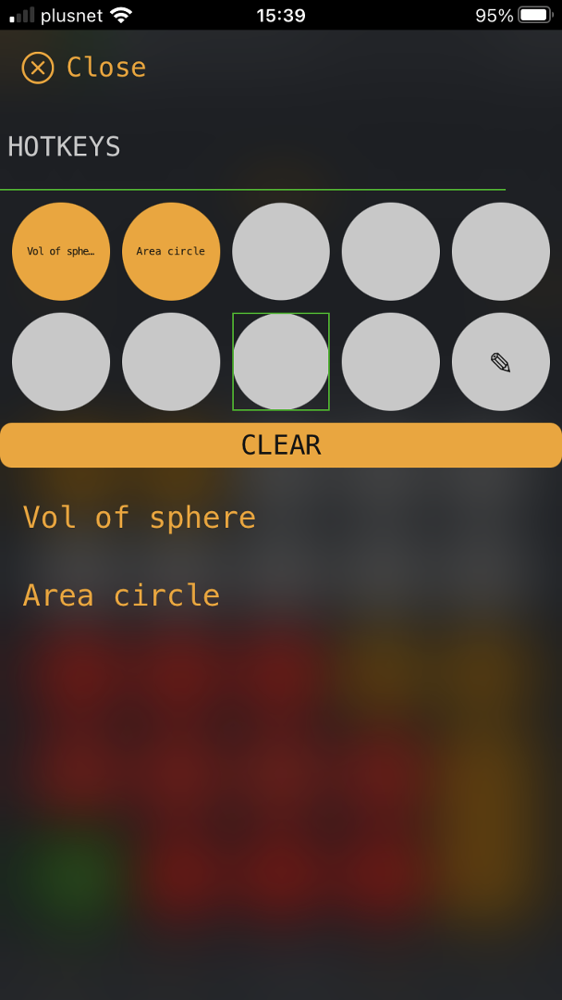
					
				

			</td>
		</tr>
	</tbody>
</table>

	

	

	

	

	

	

	Tips And Tricks

	

	You don &#39;t need to hit the close button on the various popups, just drag down from the top to close.

	

	Hitting two operators one after the other will use the previous value

	

<table class="c10">
	<tbody>
		<tr class="c1">
			<td class="c12 c34" colspan="1" rowspan="1">
				

					Pressed
				

			</td>
			<td class="c5 c34" colspan="1" rowspan="1">
				

					Resulting Equation
				

			</td>
		</tr>
		<tr class="c1">
			<td class="c12" colspan="1" rowspan="1">
				

					15
				

			</td>
			<td class="c5" colspan="1" rowspan="1">
				

					15
				

			</td>
		</tr>
		<tr class="c1">
			<td class="c12" colspan="1" rowspan="1">
				

					+ 
				

			</td>
			<td class="c5" colspan="1" rowspan="1">
				

					15 + 
				

			</td>
		</tr>
		<tr class="c1">
			<td class="c12" colspan="1" rowspan="1">
				

					+
				

			</td>
			<td class="c5" colspan="1" rowspan="1">
				

					15 + 15
				

			</td>
		</tr>
		<tr class="c1">
			<td class="c12" colspan="1" rowspan="1">
				

					+
				

			</td>
			<td class="c5" colspan="1" rowspan="1">
				

					15 + 15 + 15
				

			</td>
		</tr>
		<tr class="c1">
			<td class="c12" colspan="1" rowspan="1">
				

					-
				

			</td>
			<td class="c5" colspan="1" rowspan="1">
				

					5 + 15 + 15 - 15
				

			</td>
		</tr>
	</tbody>
</table>
